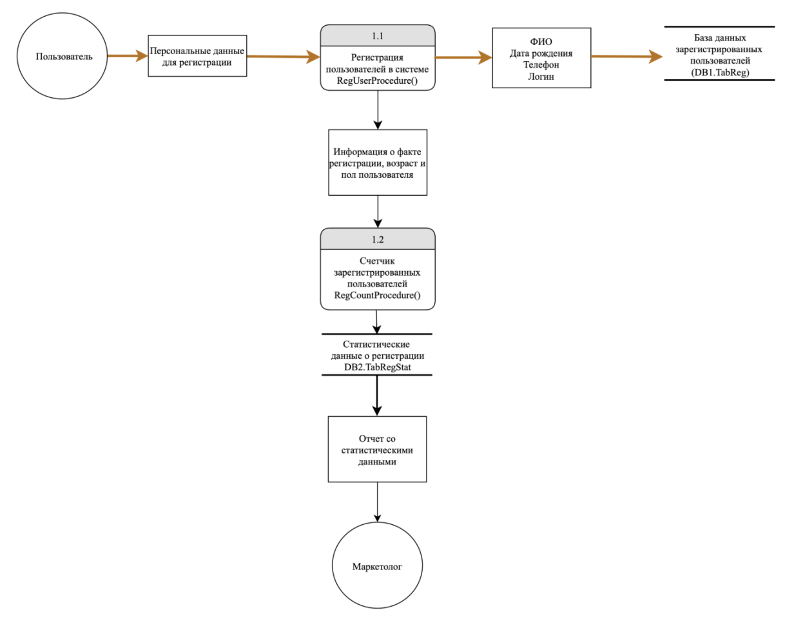

### Проектирование и моделирование угроз
1. Оценить Угрозы безопасности информации при разработке программного обеспечения (ГОСТ Р 58412-2019)
2. Сформировать DFD 


### Безопасность кода

1. Использование автотестов с функциями безопасности статичный анализ кода.
3. Безопасность аутентификации и хранения секретов
Важно помнить про способ хранения паролей хеш и соль, и передачи от пользователя к серверу в зашифрованном виде
authorization =base64.encode(username + ":" + password)
4. Управление зависимостями. Проверь проверка уязвимостей сторонних библиотек, надёжный Репозиторий
```
$ nsp check в js 
$ pip list --outdated https://requires.io/ или https://pyup.io/
```

5. Аудит и журналирование внутренних процессов. Использование брокеров сообщений kafka 
![[Pasted image 20240103161714.png]]
Минимальные требования к логгированию:
* Сбор журналов от ОС (rsyslog, syslog-hg, Windows Event)
* Аудит процессов, системных вызовов в LinuxAPI / WinAPI, файловой системы (auditd)
* Сбор журналов приложения (stdout, AppSensor)
* Журнал данных в сети (NetFlow, IPS/IDS, WAF, NGFW)
* Журнал от средств защиты (изменение конфигураций самих СЗИ, критичные события)
* События инфраструктуры (сетевое, серверное оборудование)
7. Безопасность передачи данных и шифрование
8. Безопасность приложения (XSS, SQLi, и др.)
9. Создание прав доступа ролевой модели и модели угроз приложения

