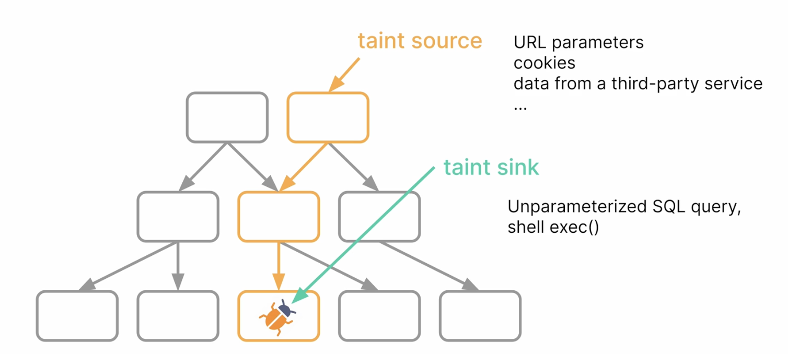

При выборе SAST важно два отличительных фактора:
- широта поддержки ЯП, и библиотека правил
- гибкость и удобство языка для написания собственных правил

Learn: https://semgrep.dev/playground/
https://semgrep.dev/docs/cheat-sheets/overview

### Basics
Syntax: https://semgrep.dev/docs/writing-rules/rule-syntax
semgrep --validate --config [filename]

### Run
Docker: 
```
# https://semgrep.dev/onboarding/scan
docker pull semgrep/semgrep
docker run -it -v "${PWD}:/src" returntocorp/semgrep semgrep login
docker run -e SEMGREP_APP_TOKEN=... --rm -v "${PWD}:/src" returntocorp/semgrep semgrep ci
docker run -e SEMGREP_APP_TOKEN=... --rm -v "${PWD}:/src" returntocorp/semgrep semgrep ci --output scan_results.txt --text
```

### Rules
Общий концепт:
1. Составить список "уязвимого" и "правильного" кода для тестирования правила
2. Стратегия обрубания: Скопировать кусок "уязвимого кода" в pattern и начать "обрубать" фолсы выявляя общий паттерн через добавление pattern-not. https://semgrep.dev/docs/writing-rules/generic-pattern-matching
3. Стратегия регулярное выражение: Если уязвимость можно найти по регулярному выражению - regex101.com
4. Стратегия добавления мета: для дополнительной фильтрации переменных $X как тонкая настройка правила
  поиск переменных которые `><=` какого-то значения > `metavariable-comparison`
  поиск конкретной переменной > `focus-metavariable`
  поиск по доп.правилу > `metavariable-pattern`
  поиск по рег.выражению > `metavariable-regex` metavariable: $METHOD regex: (insecure)
  поиск по типу > `metavariable-type` metavariable: $Y type: String или java.util.logging.LogRecord
  поиск по анализаторам энтропия > `metavariable-analysis` analyzer: entropy metavariable: $VARIABLE
 
```
# Testing rules
semgrep --config rule.yaml rule.fixed.py --autofix
```

|Директива  |Описание|
|----------:|:-------|
|`FUNC(...)`| выбрать все внутри функции|
|`"..."`    |выбрать любое значение str |
|`...`      |выбрать все|
|`\|`| ставится перед паттерном для указания многострочного паттерна|
|`$X`       |обозначает любую переменную. Писать только с заглавной буквы|
|`fix: <U>` |хорошая практика использовать эту директиву чтобы подсказывать в <U> при триаже как это можно устранить или корректно написать|
|`pattern:` |ищет точно совпадение|
|`patterns:`|логическое И. Все правила должны быть выполнены. Найдет только совпадения обоих правил|
|`pattern-either:`|логическое ИЛИ. A+B. Будет искать все совпадения.|
|`pattern-not:`|исключение|
|`pattern-not-inside`|исключает внутри класса|
|`pattern-inside`|будет искать внутри класса, функции|
|`pattern-regex`|паттерн в виде регулярного выражения|
|`metavariable-regex`|использование метаинформации для ранее определенных переменных $X|
|`mode: taint`|использование DFD для определения потока данных внутри кода|

```
rules:
  - id: untitled_rule # название правила
    
    # применение нескольких правил одновременно 
    patterns: # логическое И. Все правила должны быть выполнены. Найдет только совпадения обоих правил
      - pattern: TODO # 
      - pattern-not: TODO # 
      - pattern-not-inside: TODO # 

    pattern-either: # логическое ИЛИ. A+B. Будет искать все совпадения.
      - pattern: hashlib.sha1(...)
      - pattern: hashlib.md5(...)

    metavariable-regex: #обязательно указать metavariable: '$F' И regex: '.*(fee|salary).*'
    pattern-sinks: #
  
    message: Semgrep found a match
    languages: 
        - python # описание ЯП для валидации
    severity: WARNING
```
### Metavariables
При определении параметров поиска если дается определение $VAR $FUNC и тп можно дополнить информацию:

##### metavariable-regex. Уточнить $X путем его посика по регулярному выражению
```
    patterns:
      - pattern: module.$METHOD(...)
      - metavariable-regex:
          metavariable: $METHOD
          regex: (insecure)
```

##### metavariable-pattern. Доп.фильтрация результатов pattern
    patterns:
      - pattern: '"$STRING"'
      - metavariable-pattern:
          language: generic
          metavariable: $STRING
          pattern: "literal string contents"

##### metavariable-comparison. Уточнение с функцией сравнения $X и конвертацией
Удобство в том что $X можно изменять по типу str > int, сравнивать > < =, применять математические операции +, -, *, /,  %
```
    patterns:
      - pattern: set_port($ARG)
      - metavariable-comparison:
          comparison: $ARG < 1024 and $ARG % 2 == 0
          metavariable: $ARG
```

### Mode TAINT

Используется для data-flow анализа. Где появляется цепочка Источник данных > Санитизация > Вывод (Sink).
Полезно использовать для анализа угроз инъекций (XSS, SQLi, PathTravers, CommandInjection)
```
rules:
  - id: taint-demo-copy
    languages:
      - python
    severity: ERROR
    message: Taint reaches the sink!
    pattern-sources: # обязательно. функция получающая данные на входе
      - pattern: source()
    pattern-sinks:  # обязательно. Указывается функции выводящие во вне данные
      - pattern: sink(...)
    pattern-sanitizers: # опционально. функция проводящая санитизацию данных
      - pattern: sanitize(...)
    pattern-propagators: # опционально. функция проводящая обработку (изменение данных)
      - pattern: $TO.add($FROM)
        from: $TO
        to: $FROM
    mode: taint
```

# Use cases

### Find library
```
pattern-either:
    - pattern: import $EXPORT from AcmeCorpHTTP;
    - pattern: import { $EXPORT } from AcmeCorpHTTP;
    - pattern: var $EXPORT = require('AcmeCorpHTTP');
    - pattern: var { $EXPORT } = require('AcmeCorpHTTP');
```

### Find class
```
pattern: new AcmeCorpHTTP.ProxyAgent(...);
```

### Find func
``` 
pattern: def get_user(): ...
pattern: requests.get("...", timeout=$X, verify=True)
```

### Find secret
```
rules:
  - id: generic-entropy-assignment
    patterns:
      - pattern: string $A = "$B";
      - metavariable-analysis:
          analyzer: entropy
          metavariable: $B
```

### Find key < 2048
```
# найти pvk, err := rsa.GenerateKey(rand.Reader, 1024)
rules:
  - id: use-of-weak-rsa-key
    languages:
      - go
    severity: ERROR
    message: RSA < 2048
    patterns:
      - pattern: rsa.GenerateKey($X, $KEYSIZE)
      - metavariable-comparison:
          comparison: $KEYSIZE < 2048 and $KEYSIZE != 0
          metavariable: $KEYSIZE
```

### Parsing
