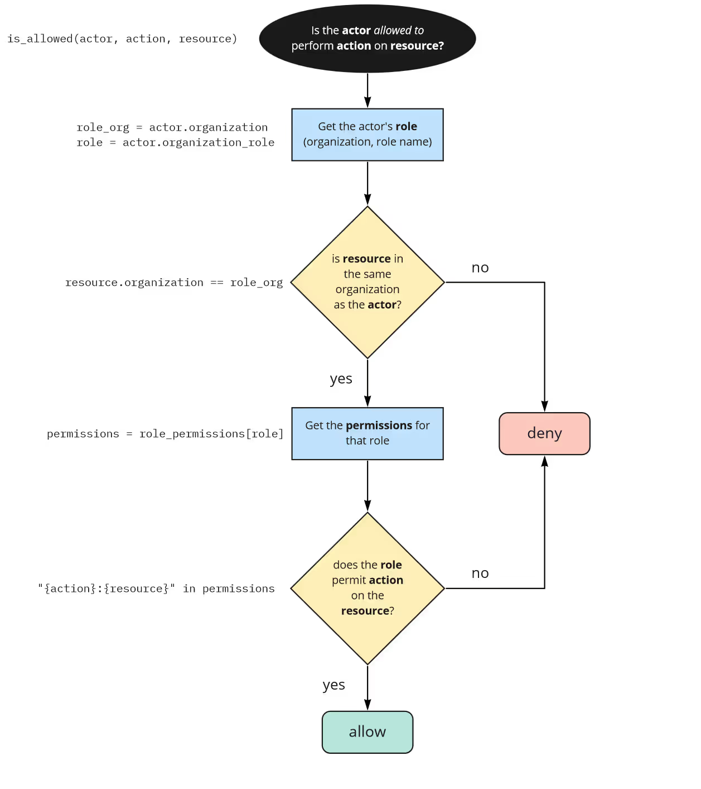

# Процесс подготовки написания политик

## 1. Определить модель доступа ACL, RBAC, ReBAC, ABAC.
На этом этапе важно выяснить следующие нюансы:
- наличие гостевого доступа (анонимного)
- функционал делегирования полномочий
  1.	Описание подходов делегирования:
    * как реализовано сейчас/как предполагается (с приложением схем процессов)
    * как различаются запросы пользователя в режиме делегирования от обычных запросов
    * как выполняется проверка прав при делегировании (для делегата)
    *	как выполняется аудит выполнения делегированных запросов
  2.	Описаны режимы делегирования:
    *	делегируется целиком или набором прав. Какие права делегируются (ручки/ендпоинты)
    *	какие ограничения делегирования планируются(сроки, типы и тп)
  3.	Как будет выполняется верификация сохранения прав у делегирующего

- наличие атрибутов у объекта субьекта, среды 
- наличие иерархий

Паттерны реализации:
[Схема drawio](Арх.паттерны.drawio)

### Модели контроля доступа

### ACL
Список управления доступом (Access Control List - ACL) представляет собой список пользователей, имеющих доступ к определенному ресурсу, а также разрешения которые каждый пользователь имеет по отношению к этому ресурсу (только чтение, чтение-запись и т. д.).
Наиболее распространенным примером ACL и DAC в действии является файловая система Windows, правила брандмауэров веб-приложений (WAF), сетевых маршрутизаторов и коммутаторов. В то время как RBAC определяет привилегии доступа на уровне роли, ACL определяет их на уровне отдельного пользователя.

### RBAC (контроль доступа на основе ролей) 
это модель, в которой доступ предоставляется или запрещается на основе ролей, назначенных пользователю. Пользователь – роль – набор прав доступа (разрешения)
https://www.osohq.com/learn/rbac-vs-abac 


#### Пример 1. Простая модель
Схема БД приложения<br>


Логика политики RBAC<br>


#### Пример 2. Роли, специфичные для ресурсов
Схема БД приложения<br>
Появление дополнительных ролей под отдельный тип ресурса


Логика политики RBAC<br>


#### Пример 3. Пользовательские роли
Когда пользователи могут создавать свои роли для своих объектов и назначать разрешения этим ролям

Схема БД приложения<br>
Появление дополнительных ролей под отдельный тип ресурса


Логика политики RBAC аналогична примеру 2.

### ReBAC (контроль доступа на основе отношений) 
это новая модель, которая предоставляет доступ на основе отношений между пользователями и ресурсами. Например, она может разрешить редактировать публикацию только тому пользователю, который ее создал. Эта модель особенно полезна в приложениях социальных сетей, сетевой диск, где доступ зависит от отношений пользователей (например, друзей, подписчиков или владельцев контента).
https://www.osohq.com/academy/relationship-based-access-control-rebac 


#### Пример 1. когда уже есть RBAC и мы дополняем его
Схема БД приложения<br>

Логика политики ReBAC<br>


#### Пример 2. Когда есть отношение «родитель-ребенок». 
сначала проверить, разрешено ли актору выполнять действие над ресурсом — через роль или отношение — и если это не удается, проверить, разрешено ли актору выполнять более общее действие над родительским ресурсом. ИЛИ пользователи объединены в группы, и для каждой группы, к которой принадлежит пользователь, вы проверяете, имеет ли группа разрешение.
Схема БД приложения<br>

Логика политики ReBAC<br>


### ABAC (Attribute-Based Access Control) 
это модель, в которой решения о доступе принимаются на основе атрибутов субъекта (пользователя), объекта (ресурса) и среды. Она динамически оценивает, может ли субъект выполнить действие над объектом, на основе этих атрибутов и политик, которые ими управляют.
https://www.osohq.com/learn/what-is-attribute-based-access-control-abac 
Для этого требуется составить перечень этих атрибутов
|Cубьект|Атрибуты|
|------|---------|
|Пользователь|роль, отдел, должность|
|Ресурс|тип, создатель|
|Действие|название (read, write, execute)|
|Среда|сеть, IP, время, устройство|

## 2. Сформировать бизнес правила для написания политик:
Делаем совместно, либо Ваш системный аналитик.

Не обязательно все, но лучше описать более сложные сценарии. Например:
Пользователь с [атрибут] [роль] может [получить доступ] [прочитать] [изменить] [удалить] свой блог если у пользователя имеется [роль] у объекта есть [атрибут]

Либо в таком формате.
Результат = allow, если у пользователя есть одна роль "blog.admin" и запрашивается один scope (действие) blog_create у клиента sps-as-web-c, для объекта blog, с атрибутами НАЗВАНИЕ, НАЗВАНИЕ…

Либо в таком
Система должна выдавать решение "decision": "allow", в случае когда:
1.	токен пользователя валиден (т.е. пройдены проверки ttl, sing verification)
2.	пользователь с ролью может запросить 
3.	

Система должна выдавать решение "decision": "deny", в случае когда:
1.	токен пользователя не валиден (не пройдены проверки ttl, sing verification)
2.	…
3.	

## 3. Определить режим работы PEP и логика исполнения решений

Выбрать, где приложение будет реализовывать логику авторизации.

Выбрать поведение модуля ИС, отвечающего за интерпретацию ответа от APA и предоставление доступа фактическому пользователю и контракт работы:<br> 
* Режим работы Deny based – т.е. «Запрещено все, что явно не разрешено», как это сейчас настроено<br>
* Режим работы Allow based – т.е. «Разрешено все, что явно не запрещено» - не рекомендуется в использовании<br>
* Режим с предписаниями obligation/restriction - т.е. APA будет формировать ответ, где указываются доп. условия когда PEP может дать положительный ответ пользователю, при положительном выполнении всех условий т.н. obligation/restriction.<br>
* Режим с рекомендациями recommendation – аналогично подходу выше, но требования не обязательны к выполнению.

Система на вход должна принимать REST API запрос (метод POST, Content-Type: application/json)
```json
{
  "input": {
      "user_token": "{ // Access_token пользователя
azp := "имя клиента"
ssoType := "internal / external"
resource_access: {}reqiest_scope := "blog_create"
client_name := "sps-as-web-c"
}", 
      "resource": "blog/slug", // Экземпляр типа объекта, к которому требуется доступ
      "scope": "entry_create" // Конкретная операция для данного экземпляра типа объекта
  }
}
```

Система на выходе должна отдавать REST API ответ на запрос JSON в формате: 
```json
{
  "decision_id": "<UUID>",
  "result": {
      "decision": "allow",
      "token_verify": {
          "correct_iat": true,
          "not_expired": true,
          "subjectid": "<UUID>",
          "valid": true,
          "valid_sign": true
      }
  }
}
```

## 4. Сформировать структуру ролевой модели для бизнес правила
Здесь только Важная оговорка – актуальность информации в зоне ответственности ИС. ATOM ID отвечает за разработку структуры и техническую интеграцию. 

Паттерны проектирования ролевой модели
Простая модель RBAC
```json
"Administrator": {
      "api/v1/sourcing/accounts": { "GET": ["ReadUserOnly"]},
      "api/v1/sourcing/integrator/accounts": { "GET": [ "WriteUserOnly" ]
```

ReBAC для графа должностей
```json
"roles_graph": {
        "admin": [ "tech-manager"],
        "tech-manager": ["tech-lead"],
        "tech-lead": ["developer", "devops", "platform-engineer"]}
```

Простая модель ABAC
```json
"user_attributes": {
       "alice": { "tenure": 20, "title": "owner" },
        "bob": { "tenure": 15, "title": "employee" },
 "pet_attributes": {
        "dog123": { "adopted": true, "age": 2, "breed": "terrier",  "name": "toto"},
        "dog456": { "adopted": false, "age": 3,"breed": "german-shepherd",  "name": "rintintin" }
```

## 5. Определить, будет ли использовать подход с PIP 
Это БД, или логическая структура где хранятся динамические или часто изменяемые атрибуты
На обсуждение: Какие атрибуты будут там храниться? Атрибуты среды, Атрибуты пользователя

## 6. Тестирование и окончание работ
После тестирования на tiam, провести неформальные ПСИ с демонстрацией работы функционала авторизации на реальном примере с devtools и 2 пользователями с разными ролями. Далее решать что делаем дальше
