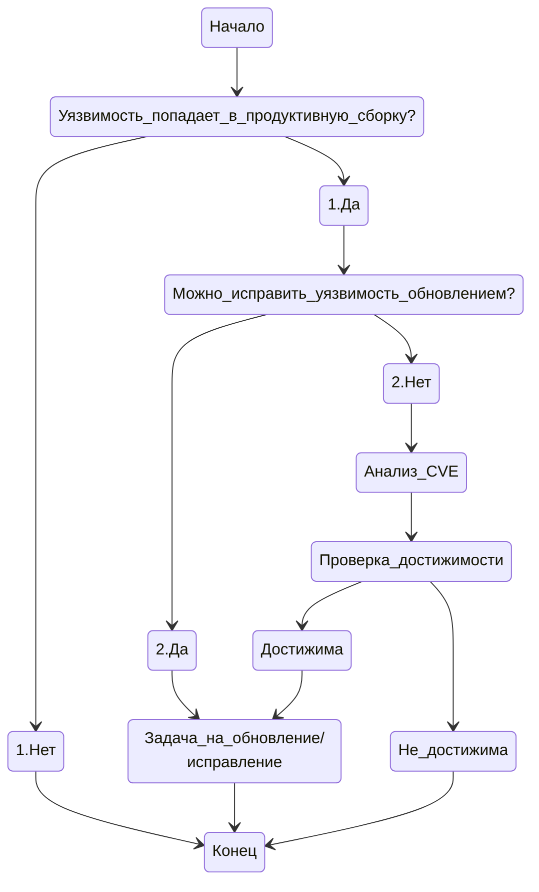

## Особенности SCA
Важно учитывать работу выбранного сканера:
- проверяет ли он только манифесты, или можно проверять сам код на предмет скрытых зависимостей (импорт в теле функций)
- учитывает ли он работу других сканеров
- проверяет ли он достижимость кода (Function-level reachability)
- учитывается ли EPSS
- учитывается ли контекст сборки (тест, прод и проч.)

## **Методология анализа (триажа) уязвимостей SCA сканера для зависимостей и транзитивных зависимостей**  

```mermaid
stateDiagram-v2
    Начало --> Уязвимость_попадает_в_продуктивную_сборку?
    Уязвимость_попадает_в_продуктивную_сборку? --> 1.Да
    Уязвимость_попадает_в_продуктивную_сборку? --> 1.Нет
    1.Нет --> Конец
    1.Да --> Можно_исправить_уязвимость_обновлением?
    Можно_исправить_уязвимость_обновлением? --> 2.Да
    2.Да --> Задача_на_обновление/исправление
    Задача_на_обновление/исправление --> Конец
    Можно_исправить_уязвимость_обновлением? --> 2.Нет
    2.Нет --> Анализ_CVE
    Анализ_CVE --> Проверка_достижимости
    Проверка_достижимости --> Достижима
    Проверка_достижимости --> Не_достижима
    Не_достижима --> Конец
    Достижима --> Задача_на_обновление/исправление
```

### **1. Подготовка данных**  
клонировать репозиторий создать локальную ветку triage_<number>
выгрузить сводку по уязвимостям из системы оркестрации DD
нормализовать, догрузить фиды (ПЕЧСИМВ ($A1) - удалить символы, Данные > Текст по столбцам)
добавить колонки
  Проверить на дубликаты #если в findings нет версии - вероятно есть дубликат где сканер смог найти
  Проверить на исключения (semgrepignore, kics), возможно сканер не проверил эти файлы
  Версия с исправлением
  Последствия
  Наличие PoC exploit
  Проверить историю прошлых разметок (новая, ссылка)	
  Используется ли в коде? (да/нет/неизвестно)	
  Уязвимая функция из описания CVE
  Путь вызова (если удалось определить)	
  Контекст вызова: среда разработки, продуктивная среда, тесты/билд-утилитах
  Первичная оценка после разметки
  Приоритет для устранения
  Комментарий от разработки
  Комментарий от сопровождения и DEVOPS
  
Выводы: 
TN - анализатор верно не нашел проблему, ее нет на самом деле
FP - анализатор нашел проблему, но ее нет на самом деле
FP: в проекте используется версия 4.23.2 и 4.29.2, уязвимость затрагивает до 4.8.0
FN - анализатор не нашел проблему, но она была в коде на самом деле
TP - анализатор верно нашел проблему, она была в коде на самом деле

# Локально проверить валидность результатов depscan с аналиом достижимости
```
depscan --profile research -t java -i . --reports-dir .\reports\reachebility --explain # с анализом достижимости
depscan --src $PWD --reports-dir $PWD/reports # простой анализ
```

#### **Java (Maven/Gradle)**
```bash
# Maven составить дерево зависимостей
mvn dependency:tree > mvn_deps.txt
```

```xml
<version>4.12</version> проверить используемую версию
<scope>test</scope> проверить скоуп - контекст вызова
  compile или не указан - зависимости с этой областью доступны в пути к классам проекта во всех задачах сборки
  provided - как compile, но JDK или контейнер предоставит зависимость во время выполнения
  runtime -  зависимость не требуется для компиляции, но требуется при выполнении
  system - зависимость необходима для компиляции и выполнения
  test - зависимость не требуется в стандартной среде выполнения приложения, а используется только в целях тестирования.
  import - в зависимости типа pom в секции `<dependencyManagement>` указывает, что указанный pom должен быть заменён зависимостями из pom'a, который указан в dependencyManagement
<type>pom</type>
```

# Gradle
```sh
gradle dependencies > gradle_deps.txt
```

#### **JavaScript/Node.js (npm/pnpm/yarn)**
```
# SemVer синтаксис
"orval": "^7.11.2" #  разрешает любые обновления, кроме первого знака (мажорной версии), Можно 7.11.5 или 7.13.1, но нельзя 8.0.0.
"orval": "7.11.2" # Установить только эту версию, никаких обновлений
"orval": "~7.11.2" #	Разрешить изменения только patch (последняя цифра). Будет 7.11.3, но не 7.12.0
"orval": "*" # Установить самую свежую версию, какая есть. Очень рискованно для безопасности!
"orval": "7.11.x" или "orval": "7.11" # Любая patch-версия внутри 7.11
"orval": ">=7.11.2 <8.0.0" # Диапазон от и до (это эквивалентно ^7.11.2)
"orval": "7.11.2 - 7.12.0" # Все версии от первой до второй включительно
"orval": "^7.11.2 || ^8.0.0" # Либо версии 7.x.x, либо 8.x.x
```

```bash
# установить зависимости для анализа
npm install
npm audit # удобно для выявления FP и анализа где испозуется
npm list --all > npm_deps.txt # npm составить дерево зависимостей
npm why <package> # для понимания точечного импорта пакета, и построения его графа

# pnpm установить зависимости для анализа (pnpm-lock.yaml)
pnpm install # pnpm init -y при наличии ошибок
pnpm install --ignore-scripts # для игнорирования скриптов
pnpm audit
pnpm list > pnpm_deps.txt
pnpm list --depth Infinity > pnpm_deps_all.txt # выводит все дерево
pnpm -r why <package> # для понимания точечного импорта пакета, и построения его графа 

# yarn составить дерево зависимостей
yarn list --all > deps.txt
```

#### **Python (pip)**
```bash
pipdeptree --json > deps.json
```

#### **.NET (NuGet)**
```bash
dotnet list package --include-transitive > deps.txt
```

#### **Go**
```bash
go list -m all > deps.txt
go mod graph

# для транзитивных зависимостей
go mod why -m golang.org/x/sys/unix
go mod graph | Select-String "x/sys/unix"

#  для поиска прямых импортов
go list -mod=mod -f '{{.ImportPath}}: {{.Imports}}' ./... | Select-String "x/sys/unix"
go list -f '{{.ImportPath}}: {{.Imports}}' ./... | Select-String "x/sys/unix" # показывает импорты
go list -mod=mod -f '{{.GoFiles}} {{.TestGoFiles}} {{.CFiles}}'' golang.org/x/sys/unix # показывает, какие файлы компилируются для приложения, включая тестовые или Си файлы
go list -mod=mod -f '{{.GoFiles}}' golang.org/x/sys/unix # 

# анализ бинарного файла - проверка вызова модуля / функции
go tool nm .\opa.exe | Select-String "x/sys/unix"
  d8f780 D golang.org/x/sys/unix.Stdin
  d8f788 D golang.org/x/sys/unix.Stdout
  d8f790 D golang.org/x/sys/unix.Stderr
  9a2b40 T golang.org/x/sys/unix.Open
  9a2d00 T golang.org/x/sys/unix.Read
  9a2f80 T golang.org/x/sys/unix.Write
  9a3120 T golang.org/x/sys/unix.Close
  ...
T означает Text (функция/код).
D означает Data (глобальная переменная).

# проверка каталога vendor, который содержит копии всех пакетов, необходимых для поддержки сборки и тестирования пакетов в основном модуле.
go mod vendor [-v] [-e] # пересоздаст vendor только с необходимыми пакетами
-e заставляет go mod vendor попытаться продолжить, несмотря на ошибки, обнаруженные при загрузке пакетов.
-v заставляет go mod vendor печатать имена поставленных модулей и пакетов в стандартную ошибку 
```

### **Сопоставление зависимостей с уязвимостями**:  
  - Запуск сканера уязвимостей и выгрузка отчета
  - Создать таблицу с колонками:  
    - Уязвимость (CVE/GHSA/идентификатор)
    - Библиотека (имя + версия)*
    - Тип зависимости (прямая/транзитивная) 
    - Критичность (CVSS, EPSS, эксплоитабельность)
    - Используется ли в коде? (да/нет/неизвестно) 
    - Путь вызова (если удалось определить)
    - Контекст вызова: среда разработки, продуктивная среда, тесты/билд-утилитах
- Приоритезировать

#### Определение Reachability вручную 
Поскольку сканер не умеет определять, используется ли уязвимый код, применяем следующие методы:  

##### Анализ через IDE
- **IntelliJ IDEA / VS Code / Eclipse**:  
  - Поиск использования (`Find Usages`) уязвимой библиотеки в проекте.  
  - Анализ импортов (`import` в Java/Go/Python, `require` в JS и т. д.).  
  - Проверка, вызываются ли методы из уязвимых классов.  

- **Пример для Java (Maven/Gradle)**:  
  ```java
  // Если есть CVE в `commons-collections:3.1`
  // Ищем в проекте:
  import org.apache.commons.collections.*;
  // Или вызовы:
  new Transformer() {...}
  ```

##### Статический анализ кода (если IDE недостаточно)
- **Semgrep**:  
  - Написать правила для поиска вызовов уязвимых методов.  
  - Пример для поиска `yaml.load()` (десериализация в Python):  
    ```yaml
    rules:
      - id: unsafe-yaml-load
        pattern: yaml.load(...)
        message: "Unsafe YAML deserialization (CVE-XXXX-XXXX)"
        languages: [python]
        severity: ERROR
    ```  
- **CodeQL (GitHub)**:  
  - Создать запрос для поиска вызовов уязвимых функций.  

##### Динамический анализ (если статического недостаточно)
- **Прокси (Burp/ZAP)**:  
  - Запустить приложение и отслеживать вызовы уязвимых библиотек.  
- **Логирование (strace/dtrace)**:  
  - На Linux: `strace -f -e trace=open,execve -o log.txt ./app`  
  - Проверить, загружается ли уязвимая библиотека.  


#### **4. Рекомендации по исправлению**  
- **Прямые зависимости**:  
  - Обновить до безопасной версии (`npm update`, `mvn versions:use-latest-versions`).  
  - Если обновление невозможно — искать альтернативные библиотеки.  
- **Транзитивные зависимости**:  
  - Добавить явное исключение (`exclude` в Maven/Gradle, `overrides` в npm).  
  - Использовать `dependency locking` (например, `pipenv`, `yarn.lock`).  

#### **3. Приоритизация уязвимостей**  
| **Критерий**               | **Высокий риск**                     | **Низкий риск**                     |  
|----------------------------|---------------------------------------|--------------------------------------|  
| **Reachability**           | Вызывается в коде                     | Не вызывается                        |  
| **Критичность (CVSS ≥ 7.0)** | Критичные RCE/десериализация          | Low/Medium (XSS, DoS в dev-среде)    |  
| **Эксплоитабельность**     | Есть публичный эксплойт (PoC)         | Нет известных эксплойтов             |  
| **Контекст использования** | В продакшене, интернет-доступ         | В тестах/билд-утилитах               |  

#### **5. Автоматизация (опционально)**  
- **Скрипты для анализа reachability**:  
  - Парсинг вызовов методов через `grep`/`ast-grep`.  
  - Интеграция с SCA-сканерами через API (например, Snyk → Jira).  
- **Мониторинг новых уязвимостей**:  
  - GitHub Dependabot + ручная проверка reachability.  
  - Регулярный запуск OWASP Dependency-Check.  

Анализ транзитивных зависимостей (когда уязвимость скрыта не в прямой зависимости, а в библиотеке, от которой зависит ваша библиотека) — сложная задача, особенно без встроенного `reachability analysis`. Вот пошаговая методология и инструменты для ручного и автоматизированного анализа.

### Go
https://github.com/ondrajz/go-callvis

### Java, JS, PHP
https://depscan.readthedocs.io/reachability-analysis/
