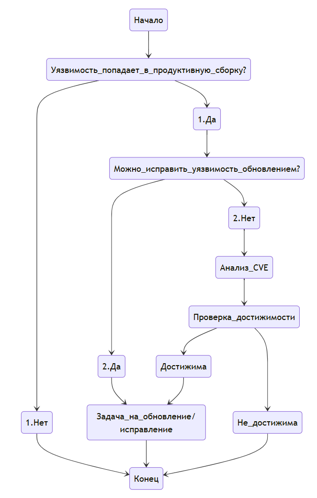

## **Методология анализа (триажа) уязвимостей SCA сканера для зависимостей и транзитивных зависимостей**  



### **1. Подготовка данных**  
клонировать репозиторий создать локальную ветку triage_<number>
выгрузить сводку по уязвимостям из системы оркестрации DD
нормализовать, догрузить фиды (ПЕЧСИМВ ($A1) - удалить символы, Данные > Текст по столбцам)
добавить колонки
  Проверить на дубликаты #если в findings нет версии - вероятно есть дубликат где сканер смог найти
  Версия с исправлением
  Последствия
  Наличие PoC exploit
  Проверить историю прошлых разметок (новая, ссылка)	
  Используется ли в коде? (да/нет/неизвестно)	
  Уязвимая функция из описания CVE
  Путь вызова (если удалось определить)	
  Контекст вызова: среда разработки, продуктивная среда, тесты/билд-утилитах
  Первичная оценка после разметки
  Приоритет для устранения
  Комментарий от разработки
  Комментарий от сопровождения и DEVOPS
  
Выводы: 
TN - анализатор верно не нашел проблему, ее нет на самом деле
FP - анализатор нашел проблему, но ее нет на самом деле
  FP: в проекте используется 2 версии 4.23.2 и 4.29.2, уязвимость затрагивает до 4.8.0
FN - анализатор не нашел проблему, но она была в коде на самом деле
TP - анализатор верно нашел проблему, она была в коде на самом деле

#### **Java (Maven/Gradle)**
```bash
# Maven составить дерево зависимостей
mvn dependency:tree > mvn_deps.txt
# Локально проверить валидность результатов depscan с аналиом достижимости
depscan --profile research -t java -i . --reports-dir .\reports\reachebility --explain # с анализом достижимости
depscan --src $PWD --reports-dir $PWD/reports # простой анализ

https://www.baeldung.com/maven-dependency-scopes
https://maven.apache.org/guides/introduction/introduction-to-dependency-mechanism.html
https://for-each.dev/lessons/b/-maven-dependency-scopes

    <version>4.12</version> проверить используемую версию
    <scope>test</scope> проверить скоуп
    <type>pom</type>

# Gradle
gradle dependencies > gradle_deps.txt
```

#### **JavaScript/Node.js (npm/yarn)**
```bash
# npm составить дерево зависимостей
npm list --all > npm_deps.txt

# yarn составить дерево зависимостей
yarn list --all > deps.txt
```

#### **Python (pip)**
```bash
pipdeptree --json > deps.json
```

#### **.NET (NuGet)**
```bash
dotnet list package --include-transitive > deps.txt
```

#### **Go**
```bash
go list -m all > deps.txt
```

### **Сопоставление зависимостей с уязвимостями**:  
  - Запуск сканера уязвимостей и выгрузка отчета
  - Создать таблицу с колонками:  
    - Уязвимость (CVE/GHSA/идентификатор)
    - Библиотека (имя + версия)*
    - Тип зависимости (прямая/транзитивная) 
    - Критичность (CVSS, EPSS, эксплоитабельность)
    - Используется ли в коде? (да/нет/неизвестно) 
    - Путь вызова (если удалось определить)
    - Контекст вызова: среда разработки, продуктивная среда, тесты/билд-утилитах
- Приоритезировать

#### Определение Reachability вручную 
Поскольку сканер не умеет определять, используется ли уязвимый код, применяем следующие методы:  

##### Анализ через IDE
- **IntelliJ IDEA / VS Code / Eclipse**:  
  - Поиск использования (`Find Usages`) уязвимой библиотеки в проекте.  
  - Анализ импортов (`import` в Java/Go/Python, `require` в JS и т. д.).  
  - Проверка, вызываются ли методы из уязвимых классов.  

- **Пример для Java (Maven/Gradle)**:  
  ```java
  // Если есть CVE в `commons-collections:3.1`
  // Ищем в проекте:
  import org.apache.commons.collections.*;
  // Или вызовы:
  new Transformer() {...}
  ```

##### Статический анализ кода (если IDE недостаточно)
- **Semgrep**:  
  - Написать правила для поиска вызовов уязвимых методов.  
  - Пример для поиска `yaml.load()` (десериализация в Python):  
    ```yaml
    rules:
      - id: unsafe-yaml-load
        pattern: yaml.load(...)
        message: "Unsafe YAML deserialization (CVE-XXXX-XXXX)"
        languages: [python]
        severity: ERROR
    ```  
- **CodeQL (GitHub)**:  
  - Создать запрос для поиска вызовов уязвимых функций.  

##### Динамический анализ (если статического недостаточно)
- **Прокси (Burp/ZAP)**:  
  - Запустить приложение и отслеживать вызовы уязвимых библиотек.  
- **Логирование (strace/dtrace)**:  
  - На Linux: `strace -f -e trace=open,execve -o log.txt ./app`  
  - Проверить, загружается ли уязвимая библиотека.  


#### **4. Рекомендации по исправлению**  
- **Прямые зависимости**:  
  - Обновить до безопасной версии (`npm update`, `mvn versions:use-latest-versions`).  
  - Если обновление невозможно — искать альтернативные библиотеки.  
- **Транзитивные зависимости**:  
  - Добавить явное исключение (`exclude` в Maven/Gradle, `overrides` в npm).  
  - Использовать `dependency locking` (например, `pipenv`, `yarn.lock`).  

#### **3. Приоритизация уязвимостей**  
| **Критерий**               | **Высокий риск**                     | **Низкий риск**                     |  
|----------------------------|---------------------------------------|--------------------------------------|  
| **Reachability**           | Вызывается в коде                     | Не вызывается                        |  
| **Критичность (CVSS ≥ 7.0)** | Критичные RCE/десериализация          | Low/Medium (XSS, DoS в dev-среде)    |  
| **Эксплоитабельность**     | Есть публичный эксплойт (PoC)         | Нет известных эксплойтов             |  
| **Контекст использования** | В продакшене, интернет-доступ         | В тестах/билд-утилитах               |  

#### **5. Автоматизация (опционально)**  
- **Скрипты для анализа reachability**:  
  - Парсинг вызовов методов через `grep`/`ast-grep`.  
  - Интеграция с SCA-сканерами через API (например, Snyk → Jira).  
- **Мониторинг новых уязвимостей**:  
  - GitHub Dependabot + ручная проверка reachability.  
  - Регулярный запуск OWASP Dependency-Check.  

Анализ транзитивных зависимостей (когда уязвимость скрыта не в прямой зависимости, а в библиотеке, от которой зависит ваша библиотека) — сложная задача, особенно без встроенного `reachability analysis`. Вот пошаговая методология и инструменты для ручного и автоматизированного анализа.

### Go
https://github.com/ondrajz/go-callvis

### Java, JS, PHP
https://depscan.readthedocs.io/reachability-analysis/
