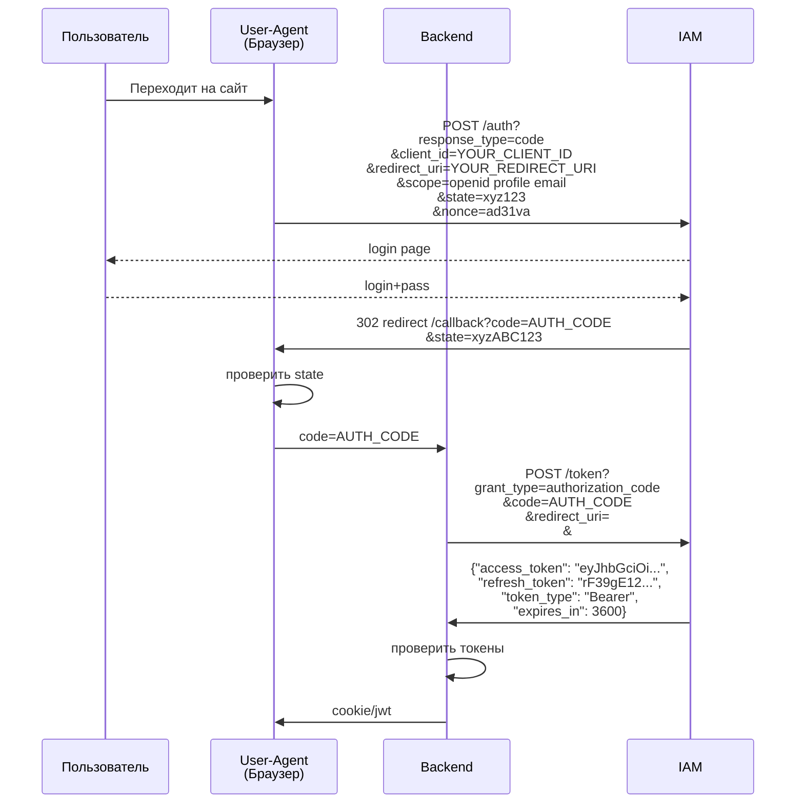

---

## 1. Базовые архитектурные требования (Core Controls)
* Обязательный `state` (CSRF-защита): Параметр `state` должен быть криптостойким, привязанным к сессии пользователя (например, храниться в `HttpOnly; Secure` куках) и проверяться строго на бэкенде **до** обмена кода на токен. Предотвращает Login CSRF и подмену аккаунтов.
* Привязка сессии при «связывании» аккаунтов (Account Linking):** Если пользователь связывает соцсеть с существующим локальным профилем, отсутствие проверки `state` позволяет злоумышленнику заставить жертву привязать *свой* аккаунт IdP, получив полный контроль через чужие учетные данные.
* Использование `PKCE` (RFC 7636): Обязательно даже для Confidential-клиентов на бэкенде. Защищает от перехвата Authorization Code (Authorization Code Interception Attack).
* Строгая валидация `redirect_uri`: Запрещен `wildcard` (маски) на стороне сервера. Сравнение должно производиться точным совпадением (Exact Match).
* Определить целевой способ передачи кода response_mode=codeб responce_type: fragment (SPA), query (default), form_post (secure), web_message (be caused)

---

## 2. Продшествующие векторы атак и нестандартные уязвимости ("Dirty Dancing" & Gadgets)

### А. Манипуляции с параметрами редиректа и ответа ("Dirty Dancing")

При аудите проверяйте отклонения от стандартного поведения авторизации:

* **Response-Type Switching:** Попытка подменить тип ответа (например, переключить с `code` на `token` или `id_token` в процессе танца). Приводит к тому, что токены падают во фрагменты URL (`#`) или редиректятся в открытом виде.
* **Response-Mode Switching:** Попытка подменить способ передачи кода авторизации.
* **Redirect URI Quirks:** Тестируйте поведение бэкенда и провайдера при искажении `redirect_uri`:
* *Path Traversal / Directory Shifting:* `[https://client.com/callback/../page](https://client.com/callback/../page)`.
* *Case Shifting:* Изменение регистра букв в хосте/пути (например, `[https://Client.com/Callback](https://Client.com/Callback)`).
* *Parameter / Path Appending:* Добавление символов в конце или подмена параметров, чтобы спровоцировать ошибку или падение приложения на кастомную страницу с уязвимым контекстом (HTML-инъекцией/XSS).

### Б. XSS + OAuth / SSO Gadgets
Даже если XSS считается "незначительным" (например, Self-XSS или ограниченная HTML-инъекция, либо сторонний скрипт аналитики на сайте вроде Hotjar), в связке с OAuth он превращается в критический Account Takeover (ATO):
* **SSO Gadgets:** Сценарий, когда атакующий через XSS инициирует скрытый или неявный поток авторизации (или использует `prompt=none`), перехватывает возвращенный `access_token` / `id_token` / `code` и отправляет его на свой сервер.
* **Referer / History / postMessage Leaks:** Утечки чувствительных параметров через заголовки `Referer` (при перенаправлениях или подгрузке ресурсов через теги вроде `<link>` с принудительным `unsafe-url`) либо через небезопасные `postMessage`-слушатели.

---

## 3. Cheat Sheet
1. **Проверьте параметр `state`:**
* Что происходит, если удалить `state` из запроса? (Принимает ли сервер запрос?).
* Можно ли использовать `state` повторно (DoS / Replay)?
* Привязан ли `state` к сессии (пытались ли подставить чужой `state`)?

2. **Протестируйте поведение при ошибках (Error Handling):**
* Вызывайте намеренные ошибки OAuth-флоу (передавая неверный `code`, дублируя `state`, меняя `client_id`). Куда редиректит приложение? Рендерит ли оно несанитизированные параметры из URL (ошибки, некорректные урлы)?

3. **Проанализируйте `redirect_uri`:**
* Поддерживает ли сервер относительные пути, обход слешей (`//`, `/\`), символы `@`, юникод или замену регистра?
* Проверить какая логика на странице redirect_uri она же callback, должна быть пустая страница в идеале ограничивать запросы от origin которые не ожидаются - для защиты от code injection атак когда атакующий сумел украть код и запрашивает его делая запрос на эту api

4. **Оцените риски утечки токенов:**
* Проверяйте, не попадают ли чувствительные токены (`access_token`, `code`) в `Referer` при загрузке внешних картинок, скриптов или шрифтов с ошибками маршрутизации.
* Аудируйте обработчики событий `window.postMessage` на предмет отсутствия проверки `event.origin`.
