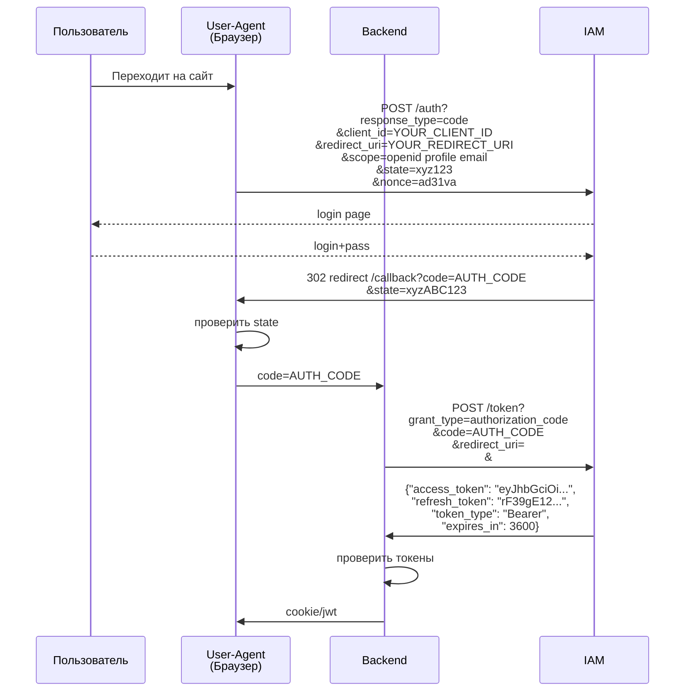

```mermaid
sequenceDiagram
    participant User as Пользователь
    participant UA as User-Agent<br>(Браузер)
    participant B as Backend
    participant IAM

    User->>UA: Переходит на сайт
    UA->>IAM: POST /auth?<br> response_type=code<br>&client_id=YOUR_CLIENT_ID<br>&redirect_uri=YOUR_REDIRECT_URI<br>&scope=openid profile email<br>&state=xyz123<br>&nonce=ad31va
    IAM-->>User: login page
    User-->>IAM: login+pass
    IAM->>UA: 302 redirect /callback?code=AUTH_CODE<br>&state=xyzABC123
    UA->>UA: проверить state
    UA->>B: code=AUTH_CODE
    B->>IAM: POST /token?<br>grant_type=authorization_code<br>&code=AUTH_CODE<br>&redirect_uri=<br>&
    IAM->>B: {"access_token": "eyJhbGciOi...",<br>"refresh_token": "rF39gE12...",<br>"token_type": "Bearer",<br>"expires_in": 3600}
    B->>B: проверить токены 
    B->>UA: cookie/jwt
```
