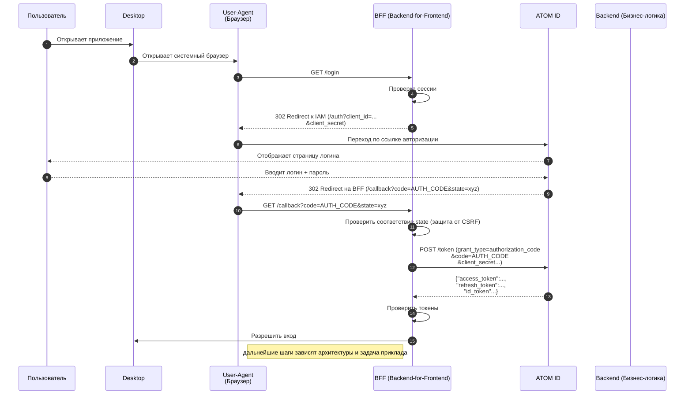

```mermaid
sequenceDiagram
autonumber
    participant User as Пользователь
    participant Desktop
    participant UA as User-Agent<br>(Браузер)
    participant BFF as BFF (Backend-for-Frontend)
    participant IAM as ATOM ID
    participant B as Backend (Бизнес-логика)

    %% 1. Инициация входа / проверка сессии
    User->>Desktop: Открывает приложение
    Desktop->>UA: Открывает системный браузер
    UA->>BFF: GET /login
    BFF->>BFF: Проверка сессии
    BFF-->>UA: 302 Redirect к IAM (/auth?client_id=...<br>&client_secret)
    UA->>IAM: Переход по ссылке авторизации

    %% 2. Аутентификация на стороне IAM
    IAM-->>User: Отображает страницу логина
    User-->>IAM: Вводит логин + пароль
    IAM-->>UA: 302 Redirect на BFF (/callback?code=AUTH_CODE&state=xyz)

    %% 3. Обработка Callback на BFF и обмен кода на токены
    UA->>BFF: GET /callback?code=AUTH_CODE&state=xyz
    BFF->>BFF: Проверить соответствие state (защита от CSRF)
    BFF->>IAM: POST /token (grant_type=authorization_code<br>&code=AUTH_CODE<br>&client_secret...)
    IAM-->>BFF: {"access_token":...,<br>"refresh_token":...,<br>"id_token"...}
    BFF->>BFF: Проверить токены
    BFF->>Desktop: Разрешить вход
    note right of UA: дальнейшие шаги зависят архитектуры и задача приклада

```
