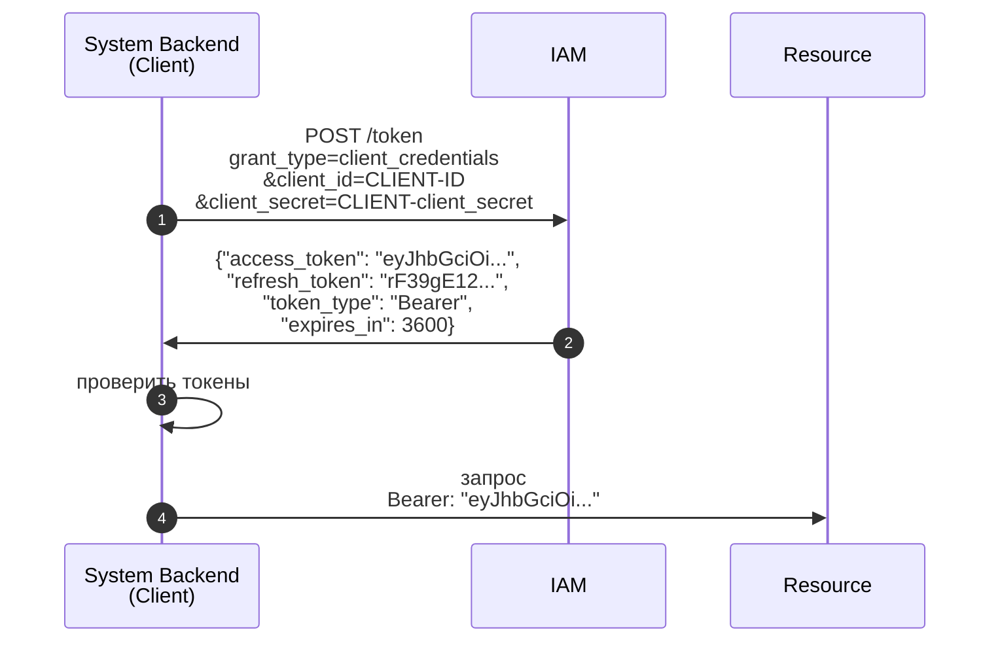

```mermaid
sequenceDiagram
    autonumber
    participant Client as System Backend<br>(Client)
    participant IAM
    participant API as Resource

    Client->>IAM: POST /token<br>grant_type=client_credentials<br>&client_id=CLIENT-ID<br>&client_secret=CLIENT-client_secret
    IAM->>Client: {"access_token": "eyJhbGciOi...",<br>"refresh_token": "rF39gE12...",<br>"token_type": "Bearer",<br>"expires_in": 3600}
    Client->>Client: проверить токены
    Client->>API: запрос<br>Bearer: "eyJhbGciOi..."
```
