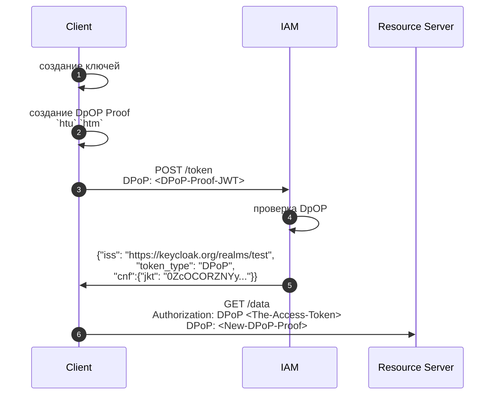

https://datatracker.ietf.org/doc/html/rfc9449

### Что защищает
Связывает access и refresh token к public/private ключам создаваемые клиентом.

### Оn чего не защищает

### Когда использовать
* Публичные клиенты SPA или нативные мобильные приложения, в которых невозможно безопасно хранить секретные данные клиента.
* Веб приложения, где токены могут быть скомпрометированы через XSS-атаки, хранилище браузера или вредоносные расширения.
* Среды с высоким уровнем безопасности, где предотвращение повторного воспроизведения токенов является строгим требованием соответствия (например, API финансового уровня).
* Защита API разных клиентов приложение, аутентифицированное с помощью Keycloak, вызывает REST-сервис service1 с использованием токена доступа. Сервис service1 должен иметь возможность использовать токен доступа, но он не должен иметь возможность использовать этот токен для вызова других сервисов от имени исходного приложения.

### Как работает


DpOP token
```
{
  "typ": "dpop+jwt",
  "alg": "ES256",
  "jwk": { // public key
    "kty": "EC",
    "crv": "P-256",
    "x": "f83OJ3D2xF4...",
    "y": "x_FEzRu9Yq8..."
  }
},
{
  "jti": "BwC3ESc6acc2lTc", // уникальный идентификатор запроса для валидации
  "htm": "GET", // метод с которым будет осуществляться запрос к Resource Server
  "htu": "https://resource.server.lab/data", // адрес запроса
  "iat": 1562262616 // время жизни токена
}
```
