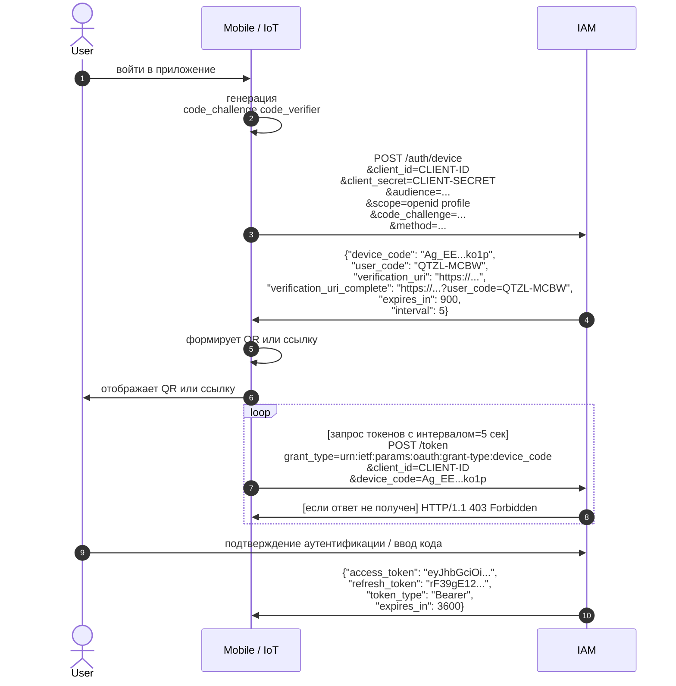

```mermaid
sequenceDiagram
    autonumber
    actor User
    participant Device as Mobile / IoT
    participant IAM

    User->>Device: войти в приложение
    Device->>Device: генерация<br>code_challenge code_verifier
    Device->>IAM: POST /auth/device<br>&client_id=CLIENT-ID<br>&client_secret=CLIENT-SECRET<br>&audience=...<br>&scope=openid profile<br>&code_challenge=...<br>&method=...
    IAM->>Device: {"device_code": "Ag_EE...ko1p",<br>"user_code": "QTZL-MCBW",<br>"verification_uri": "https://...",<br>"verification_uri_complete": "https://...?user_code=QTZL-MCBW",<br>"expires_in": 900,<br>"interval": 5}
    Device->>Device: формирует QR или ссылку
    Device->>User: отображает QR или ссылку
    loop
        Device->>IAM: [запрос токенов c интервалом=5 сек]<br>POST /token<br>grant_type=urn:ietf:params:oauth:grant-type:device_code<br>&client_id=CLIENT-ID<br>&device_code=Ag_EE...ko1p
        IAM->>Device: [если ответ не получен] HTTP/1.1 403 Forbidden
    end
    User->>IAM: подтверждение аутентификации / ввод кода
    IAM->>Device: {"access_token": "eyJhbGciOi...",<br>"refresh_token": "rF39gE12...",<br>"token_type": "Bearer",<br>"expires_in": 3600}
```
