Вводит новый параметр authorization_details, используемый в запросе авторизации для упрощения передачи подробных данных авторизации на сервер авторизации. 
В стандартном потоке кода авторизации клиент отправляет запрос на авторизацию, направляя пользовательский агент — обычно веб-браузер — на выполнение HTTP-GET запроса к конечной точке авторизации сервера авторизации. 
Однако PAR вносит ключевое изменение: он разделяет запрос на авторизацию на два отдельных этапа — и это изменение играет важную роль в повышении общей безопасности потока.

Пример из RFC
```
{
   "type": "payment_initiation",
   "locations": [
      "https://example.com/payments"
   ],
   "instructedAmount": {
      "currency": "EUR",
      "amount": "123.50"
   },
   "creditorName": "Merchant A",
   "creditorAccount": {
      "bic":"ABCIDEFFXXX",
      "iban": "DE02100100109307118603"
   },
   "remittanceInformationUnstructured": "Ref Number Merchant"
}
```

Как это работает

```mermaid
sequenceDiagram
    autonumber

    actor User as User
    participant Browser as Browser
    participant Client as OAuth Client
    participant AS as Authorization Server
    participant RS as Resource Server

    Note over User,RS: OAuth 2.0 / OIDC Authorization Code Flow + PAR + PKCE

    %% ============================================================
    %% 1. User starts login
    %% ============================================================

    User->>Browser: Open my-app.example.com
    Browser->>Client: GET /
    Client-->>Browser: Login page

    User->>Browser: Click "Login"

    %% ============================================================
    %% 2. Client creates authorization request
    %% ============================================================

    Note over Client: Generate state\nGenerate code_verifier\nCalculate code_challenge = BASE64URL(SHA256(code_verifier))

    %% ============================================================
    %% 3. PAR - Back Channel
    %% ============================================================

    Client->>AS: POST /par
    Note right of Client: Back-channel request

    Client->>AS: client_id=my-app
    Client->>AS: response_type=code
    Client->>AS: redirect_uri=https://my-app.example.com/callback
    Client->>AS: scope=openid profile
    Client->>AS: state=abc123
    Client->>AS: code_challenge=xyz...
    Client->>AS: code_challenge_method=S256

    Note over AS: Validate PAR request\nValidate client authentication\nValidate redirect_uri\nValidate scopes\nValidate response_type\nStore authorization request

    AS-->>Client: 201 Created
    AS-->>Client: request_uri=urn:ietf:params:oauth:request_uri:abc...
    AS-->>Client: expires_in=60

    %% ============================================================
    %% 4. Client redirects Browser to Authorization Endpoint
    %% ============================================================

    Client-->>Browser: HTTP 302\nLocation: /authorize?client_id=my-app&request_uri=...

    Browser->>AS: GET /authorize?client_id=my-app&request_uri=...

    Note over AS: Resolve request_uri\nLoad stored authorization request

    AS->>AS: Restore original request parameters

    Note over AS: client_id=my-app\nresponse_type=code\nredirect_uri=...\nscope=openid profile\nstate=abc123\ncode_challenge=xyz...

    %% ============================================================
    %% 5. User Authentication
    %% ============================================================

    AS-->>Browser: Login page
    User->>Browser: Enter username/password
    Browser->>AS: POST /login\ncredentials

    AS->>AS: Authenticate user

    AS-->>Browser: Authentication successful

    %% ============================================================
    %% 6. Consent
    %% ============================================================

    AS-->>Browser: Consent page\n"Allow my-app to access your profile?"

    User->>Browser: Click "Allow"
    Browser->>AS: POST /consent\napprove=true

    AS->>AS: Validate authorization request
    AS->>AS: Validate user consent

    %% ============================================================
    %% 7. Authorization Code
    %% ============================================================

    AS->>AS: Generate authorization code

    Note over AS: Store code binding:\ncode\nclient_id\nuser\nredirect_uri\nscope\ncode_challenge\nexpiration

    AS-->>Browser: HTTP 302\nLocation: https://my-app.example.com/callback?code=...&state=abc123

    %% ============================================================
    %% 8. Browser sends code to Client
    %% ============================================================

    Browser->>Client: GET /callback?code=...&state=abc123

    Client->>Client: Validate state

    Note over Client: state == previously stored state

    %% ============================================================
    %% 9. Token Exchange - Back Channel
    %% ============================================================

    Client->>AS: POST /token

    Note right of Client: Back-channel request

    Client->>AS: grant_type=authorization_code
    Client->>AS: client_id=my-app
    Client->>AS: code=...
    Client->>AS: redirect_uri=https://my-app.example.com/callback
    Client->>AS: code_verifier=...

    %% ============================================================
    %% 10. Authorization Code validation
    %% ============================================================

    AS->>AS: Find authorization code
    AS->>AS: Check code expiration
    AS->>AS: Check code not used
    AS->>AS: Check client_id
    AS->>AS: Check redirect_uri
    AS->>AS: Verify PKCE

    Note over AS: SHA256(code_verifier)\n== code_challenge

    AS->>AS: Mark authorization code as used

    %% ============================================================
    %% 11. Token issuance
    %% ============================================================

    AS->>AS: Generate access_token
    AS->>AS: Generate ID token
    AS->>AS: Generate refresh_token

    AS-->>Client: 200 OK
    AS-->>Client: access_token
    AS-->>Client: id_token
    AS-->>Client: refresh_token
    AS-->>Client: expires_in=300

    %% ============================================================
    %% 12. Client calls Resource Server
    %% ============================================================

    Client->>RS: GET /api/user
    Client->>RS: Authorization: Bearer access_token

    RS->>RS: Validate access_token
    RS->>RS: Check signature / introspection
    RS->>RS: Check expiration
    RS->>RS: Check scopes

    RS-->>Client: 200 OK\nUser data

    %% ============================================================
    %% 13. Client responds to User
    %% ============================================================

    Client-->>Browser: Application page
    Browser-->>User: Logged in
```



PAR обеспечивает значительное улучшение безопасности и удобства использования по нескольким причинам:
Параметры запроса больше не передаются через браузер , что исключает их раскрытие конечному пользователю и решает проблемы нарушение конфиденциальности и отсутствие запроса в качестве ссылки.
Это также решает проблему обработки больших объемов данных запросов, поскольку теперь они передаются напрямую по защищенному соединению, а не встраиваются в URL-адрес, что делает этот вариант предпочтительным для мобильных устройств с ограниченными ресурсами, а также в условиях низкой скорости интернет-соединения.
