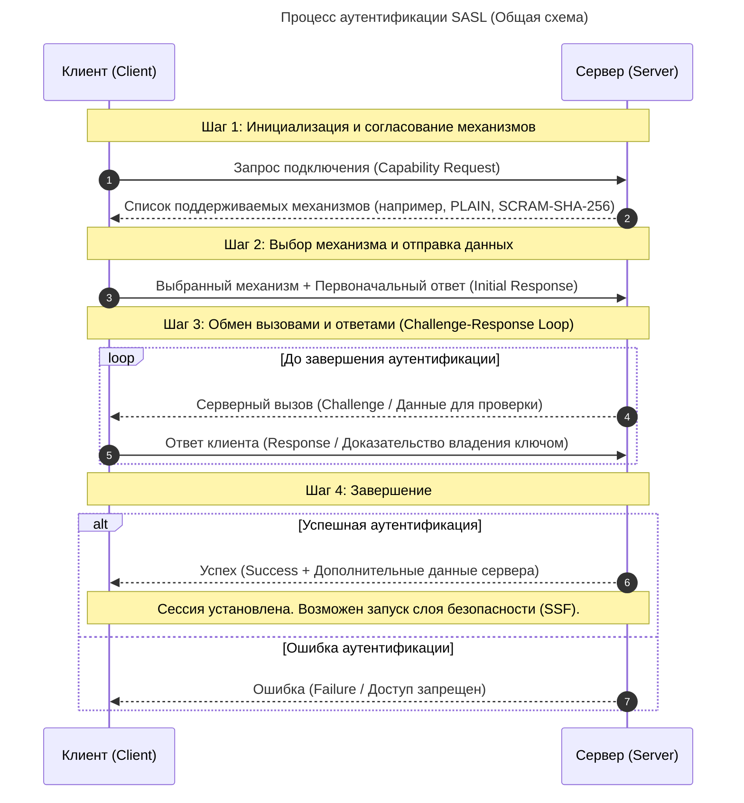

RFC 4422 - базовый
RFC 5801 -  которая добавила поддержку разновидностей механизма SCRAM, приватных префиксов и каналов безопасности.
RFC 7677 - наиболее актуальная является выпущенная в 2015 году спецификация 

Механизм аутентификации представляет собой способ, с помощью которого происходит обмен сообщениями между пользователем и сервером. Основные механизмы аутентификации SASL:
```
Поток сообщений аутентификации SASL:
Чтобы начать обмен по схеме аутентификации SASL, сервер передаёт сообщение AuthenticationSASL. Оно содержит список механизмов аутентификации SASL, с которыми может работать сервер, в порядке предпочтений сервера.
Клиент выбирает один из поддерживаемых механизмов из списка и передаёт серверу сообщение SASLInitialResponse. Это сообщение содержит имя выбранного механизма и может содержать «Начальный ответ клиента», если это использует выбранный механизм.
За этим следует одно или нескольких сообщений вызова со стороны сервера и ответов со стороны клиента. Все вызовы сервер передаёт в сообщениях AuthenticationSASLContinue, а клиент отвечает на них сообщениями SASLResponse. Частные детали сообщений зависят от конкретного механизма.
Наконец, когда обмен аутентификационной информацией заканчивается успешно, сервер передаёт сообщение AuthenticationSASLFinal и сразу за ним сообщение AuthenticationOk. В сообщении AuthenticationSASLFinal передаются дополнительные данные от сервера клиенту, содержимое которых определяется выбранным механизмом аутентификации. Если механизм аутентификации не требует передавать дополнительные данные в завершение обмена, сообщение AuthenticationSASLFinal опускается.
В случае ошибки сервер может прервать процесс аутентификации на любом этапе и передать сообщение ErrorMessage.

Типы SASL аутентификации
EXTERNAL — аутентификация работает в контексте протоколов с уже определенными технологиями защиты, такими как TLS и IPSec.
ANONYMOUS — для анонимного гостевого доступа.
SCRAM — стандартный механизм формата «запрос — ответ».
GSSAPI — механизм на основе протокола Kerberos, основанного на криптографии симметричных ключей.
OAUTHBEARER — аутентификация проходит с помощью OAuth-токенов 2.0.
PLAIN — позволяет передавать логин и пароль в открытом виде.
DIGEST-MD5 — пользователю присваивается уникальный идентификатор, основанный на хеше его пароля и других данных.
CRAM-MD5 — работает по тому же принципу, что и DIGEST-MD5, но помимо этого предоставляет защиту от атак повторного воспроизведения.
```

Схема


Каждый механизм может работать с различными протоколами передачи данных — интерфейсами, которые обеспечивают их целостность и конфиденциальность. Механизмы аутентификации SASL поддерживают большинство из популярных протоколов, например:
```
ACAP (Application Configuration Access Protocol) — позволяет клиенту получить доступ к конфигурационным данным сервера.
AMQP (Advanced Message Queuing Protocol) — позволяет компонентам системы обмениваться сообщениями.
BEEP (Blocks Extensible Exchange Protocol) — фреймворк для создания многофункциональных протоколов обмена разными типами сообщений.
IMAP (Internet Message Access Protocol) — используется для работы с почтовыми серверами.
IRC (Internet Relay Chat) — позволяет обмениваться сообщениями и файлами в режиме реального времени.
LDAP (Lightweight Directory Access Protocol) — легковесный протокол для совершения простых операций на сервере.
EMPP (Extensible Messaging and Presence Protocol или Jabber) — используется в соцсетях для обмена текстом и медиаконтентом.
```
