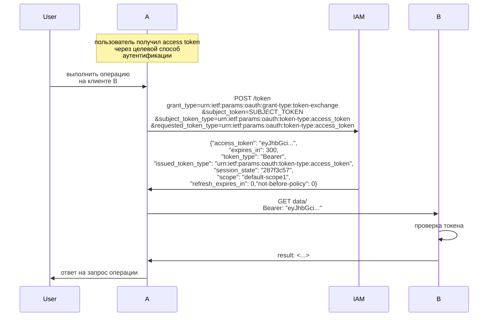

```mermaid
sequenceDiagram
    participant User
    participant A
    participant IAM
    participant B
    
    Note over A: пользователь получил access token<br>через целевой способ<br>аутентификации
    User ->> A: выполнить операцию<br>на клиенте B
    A ->> IAM:  POST /token<br>grant_type=urn:ietf:params:oauth:grant-type:token-exchange<br>&subject_token=SUBJECT_TOKEN<br>&subject_token_type=urn:ietf:params:oauth:token-type:access_token<br>&requested_token_type=urn:ietf:params:oauth:token-type:access_token
    IAM->> A: {"access_token": "eyJhbGci...",<br>"expires_in": 300,<br>"token_type": "Bearer",<br>"issued_token_type": "urn:ietf:params:oauth:token-type:access_token",<br>"session_state": "287f3c57",<br>"scope": "default-scope1",<br>"refresh_expires_in": 0,"not-before-policy": 0}
    A->>B: GET data/<br>Bearer: "eyJhbGci..."
    B->>B: проверка токена
    B->>A: result: <...>
    A->>User: ответ на запрос операции
```
