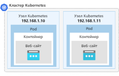

Зачем: масштабируемость, отказоустойчивость, разные варианты развертывания приложений и их обновление


```
Claster
|_ Namespace
  |_ Node
    |_ Pod
	  |_ App
	  |_ Volume
```

**Master Node:** ВМ, или сервер. Имеет IP
	- API Server - перехват всех запросов и их обработка. Взаимодействует с KV data storage для получения информации  сохранения информации в него
	- Scheduler - это компонент, отвечающий за назначение рабочих нагрузок на всех узлах. 
	- Controller managers
	- Etcd или KV data storage (хранит конфигурацию кластера. etcd не отвечает за резервное копирование данных. Вы несете ответственность за обеспечение наличия эффективного плана для резервного копирования данных etcd)

**Worker Node:**  ВМ, или сервер. Имеет IP
	- Container runtime (cri-o,  containerd, docker, mirantis)
	- Kubelet (агент для общения с control plane - API server, общается с самим контейнером через grpc)
	- Kube-proxy (обеспечивает правила сетевого взаимодействия)
	- Pode(s) - контейнер или несколько контейнеров с одной функцией внутри Node. Имеет своей IP 
		ConfigMap -  словарь параметров конфигурации ключ-значение
		Secret - секреты, пароли, токены, сертификаты в base64
		Ingress - содержит список правил доступа для входящего сетевого трафика
		Egress - содержит список правил доступа для исходящего сетевого трафика.
		NetworkPolicy - механизм управления сетевыми политиками


Service - конфигурирует под (его IP как запускается )
Deployment - определяет репликацию подов (важен для stateLESS app)
StatefulSet - определяет репликацию подов (важен для stateFULL app)
Volumes - хранилище информации (внутреннее или внешнее по отнош. к кластеру)

Состав:
etcd
cubelet

Cloud Native обозначает концепцию создания и запуска приложений для использования распределенных вычислений, доступных в облачной модели доставки.

### Pod
```sh
# create yaml file
apiVersion: v1
kind: Pod
metadata:
  name: nginx-pod
spec:
  containers:
  - name: nginx-pod
    image: nginx:1.22.1
    ports:
    - containerPort: 80

#  CLI
kubectl create -f def-pod.yaml
kubectl run nginx-pod --image=nginx:1.22.1 --port=80

kubectl apply -f nginx-pod.yaml
kubectl get pods
kubectl get pod nginx-pod -o yaml
kubectl describe pod nginx-pod
kubectl delete pod nginx-pod
```
