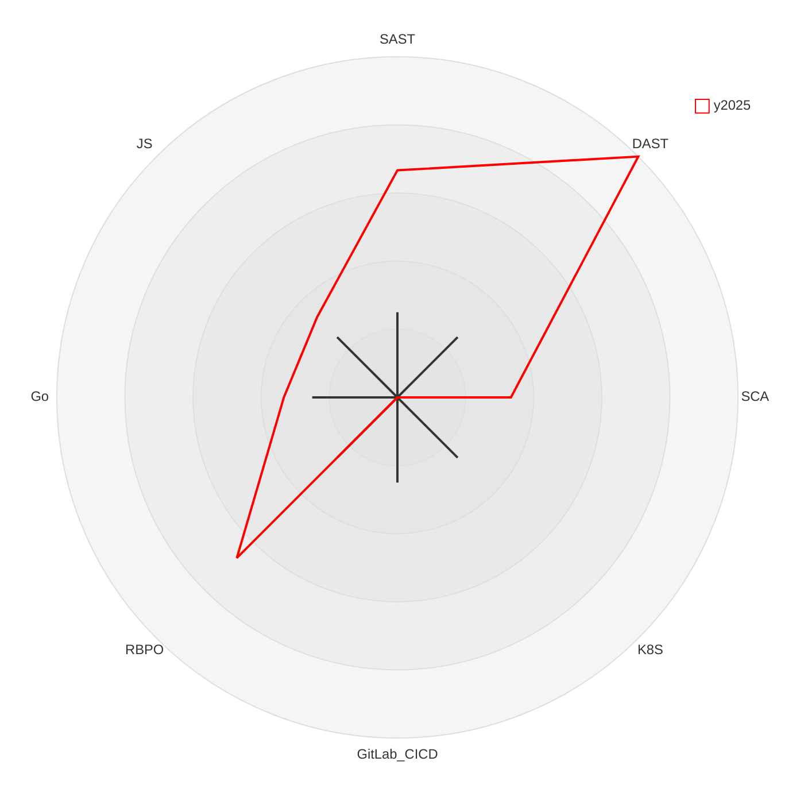

Компетенции:

```sh
# НФТ по ИБ
Анализ БТ, формирование НФТ по ИБ для составления ПМИ и проведения ПСИ, проведение ПСИ
Базис: методология Owasp ASVS, WSTG, ГОСТы РБПО
Составление модели угроз
Обучение: 
* portswigger
* THM
* picoctf

# Инструменты
### DAST
Nuclei: написание и отладка шаблонов, проверка на безопасность шаблонов [3/5]
BurpSuite: использование для поиска багов, тестирование продукта [4/5]
Postman: работа с API, тестирование и отладка поведения на ПСИ [4/5]

### SAST
Semgrep: написание простых правил по паттерну, разметка результатов работы, триаж [3/5]
CodeQL: использование со страндартными правилами, аудит по правилам, написание простых правил [1/5]

### SCA OSS
OWASP dep-scan: разметка результатов работы, триаж [1/5]
KICS: разметка результатов работы, триаж [1/5]
Feeds: нет [1/5]

### DevSecOps tools
Git: базовые навыки работы с локальным и удаленным репозиторием, и работы с ветками малых проектов [3/5]
OPA: поднятие сервера, администрирование и конфигурирование, внедрение в продукты [4/5]
Vault: поднятие кластера, администрирование и конфигурирование [2/5]
Docker:  [1/5]
K8S: слабо [0/5]
GitLab CICD: слабо [0/5]

# РБПО и триаж:
Data flow
Control flow
Taint analisys
Reachebility analisys
Анализ CVE
Анализ pipeline CI CD
Проведение тестирования white box

# ЯП и программирование
Rego: написание, отладка политик авторизации, написание юнит-тестов
Bash: написание простых скриптов
Python: чтение + есть проекты + дать ссылки
Go: чтение + нужно подлатать и создать проект
JS: чтение + нужно подлатать и создать проект
```

Диаграмма компетенций
