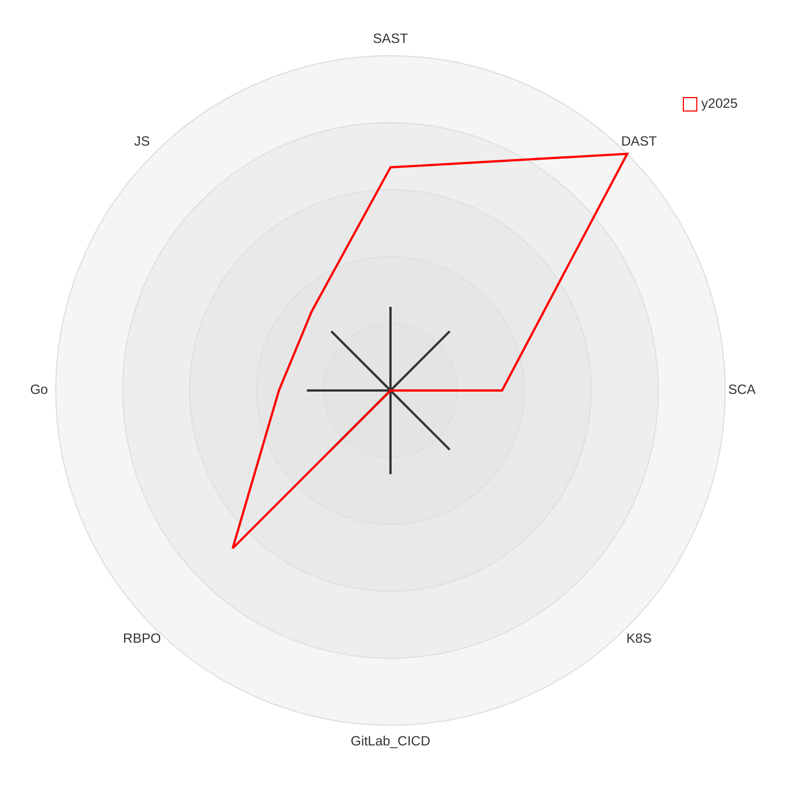

Компетенции:

```txt
# НФТ по ИБ
Анализ БТ, формирование НФТ по ИБ для составления ПМИ и проведения ПСИ, проведение ПСИ
Базис: методология Owasp ASVS, WSTG, ГОСТы РБПО
Составление модели угроз
Обучение: 
* portswigger
* THM
* picoctf

# AppSec tools
### DAST
Nuclei: написание и отладка шаблонов, проверка на безопасность шаблонов [3/5]
BurpSuite/ZAP: использование для поиска багов, тестирование продукта [4/5]
Postman: работа с API, тестирование и отладка поведения на ПСИ [4/5]

### SAST
Semgrep: написание простых правил по паттерну, разметка результатов работы, триаж [3/5]
CodeQL: использование со страндартными правилами, аудит по правилам, написание простых правил [1/5]

### SCA OSS
OWASP dep-scan: разметка результатов работы, триаж [1/5]
KICS: разметка результатов работы, триаж [1/5]
Feeds: нет [1/5]

### DevSecOps tools
Git: базовые навыки работы с локальным и удаленным репозиторием, и работы с ветками малых проектов [3/5]
OPA: поднятие сервера, администрирование, разработка политик авторизации и архитектурный контроль [4/5]
Vault: поднятие кластера в отказоустойчивом + георезерв, администрирование и конфигурирование, подлючение клиентов [5/5]
Keycloak: конфигурирование и подключение клиентов, архитектурный контроль [3/5]
Docker:  [1/5]
K8S: [0/5]
GitLab CICD: слабо [2/5]

# AI безопасность
Создание и внедрение AI агента для триажа уязвимостей (анализ сработок) [4/5]
Оценка и анализ защищенности AI driven [0/5]

# Арх контроль и продуктовая безопасность
Сильные стороны: аутентификация [OAuth2.0 OIDC], авторизация [ABAC, RBAC, ReBAC]

# Codereview, triage
Data flow
Control flow
Taint analisys
Reachebility analisys
Анализ CVE
Анализ pipeline CI CD
Проведение тестирования white box

# ЯП и программирование, стек
Rego: написание, отладка политик авторизации, написание юнит-тестов
Bash: написание простых скриптов
Python: чтение + есть проекты + дать ссылки
Go: чтение + нужно подлатать и создать проект
JS: чтение + нужно подлатать и создать проект
VoIP: SIP, RTP
Web: HTTP 1.1/2, WebSockets
RADIUS
API: gRPC, REST, GraphQL
OAuth2.0 OIDC
```

Диаграмма компетенций

```mermaid
---
config:
  radar:
    axisScaleFactor: 0.25
    curveTension: 0.0
  theme: base
  themeVariables:
    cScale0: "#FF0000"
    cScale1: "#00FF00"
    cScale2: "#0000FF"
    radar:
      curveOpacity: 0
---
radar-beta
  axis SAST, DAST, SCA, K8S, GitLab_CICD, RBPO, Go, JS 
  curve y2025{2,3,1,0,0,2,1,1}
```